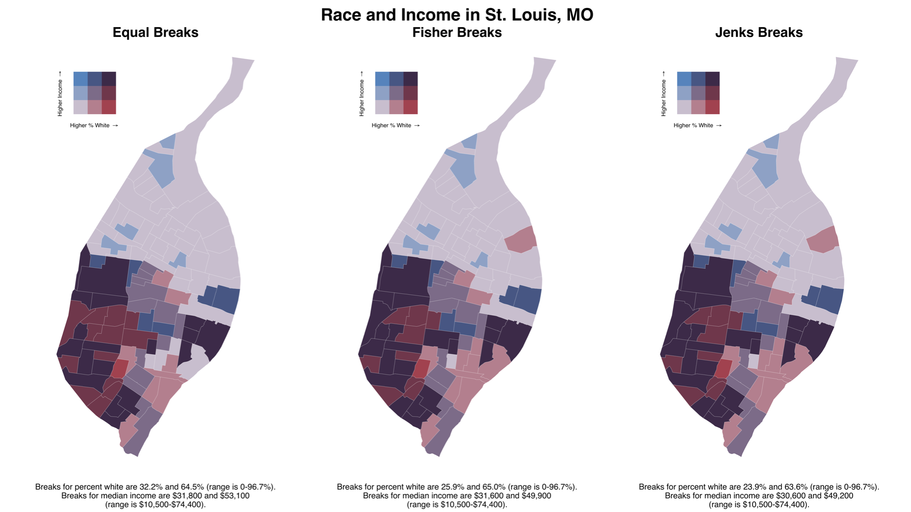

Project Proposal
================
Ting Chang

# Introduction to problem/question

I have read several articles discussing about the problem of domestic
violence after many governments around the world have imposed the
lock-down policy (or stay home order). For instance, [Ertan et al.,
(2020)](https://doi.org/10.1080/20008198.2020.1800245) and
[Bradbury-Jones and Isham, (2020)](https://doi.org/10.1111/jocn.15296))
have mentioned that many countries reported that the domestic violence
have increased after the lock-down. I would like to validate the
reported issue with historical crime data, specifically to examine the
domestic violence variation before and after lock-down in the Chicago
City, Illinois.

# Problem / Question

The question I would try to answer is how did the domestic violence
change in Chicago City after the lock-down policy has imposed?

# Inspiring Examples

## Bivarite Maps

I think these maps is really useful since it can plot out two variables
in one map at a time. This
[website](https://cran.r-project.org/web/packages/biscale/vignettes/biscale.html)
provide a tutorial about how to plot out bivarite map with ggplot.

## Boxplot overtime

This plot inspires me to plot out the domestic violence of Chicago City
in box plot over time. It not only shows the data’s distribution, but
also the temporal variation, which I found to be very helpful. Here is
the
[tutorial](https://blog.exploratory.io/filter-with-date-function-ce8e84be680)
about how to plot it!

## Maps Animations

 I think it would
be nice to visualize the domestic violence spatial distribution in
animation to show the variation overtime. Still need to think about how
to make the animation change by a time variable. Again, here is a
[tutorial](https://www.blog.cultureofinsight.com/2017/09/animated-choropleth-maps-in-r/)
about how to make map animation using SF and gganimate packages.

# Proposed data sources

I plan to acquire my data from two sources:

1.  [Chicago Data
    Portal](https://data.cityofchicago.org/Public-Safety/Crimes-2001-to-Present/ijzp-q8t2):
    this data provides the reported crime incidents from 2001 to
    present.
2.  tidycensus package: I plan to obtain the census data from the
    tidycensus package.

# Proposed methods

The analyses will focus on visualizing the variation of domestic
violence before and after the lock-down. I will mainly use the packages
introduced in this class, for instance, ggplot2, SF. I also found a
package called “gganimate”, which can easily be applied with ggplot to
convert the plot to GIF. For the temporal variation, I would like to
plot out the domestic violence using the boxplot overtime shown below.
And for the spatial variation, I would use SF package to manipulate the
data and make several maps to show the spatial distribution. However, I
also want to incorporate the temporal variation of domestic violence in
my maps, and I am still thinking about how to visualize the maps,
animation might be one approach.

# Expected results

I hope to generate several plots and maps that could provide information
about the temporal and spatial distribution of domestic violence. In
addition, I hope to examine the correlations between domestic violence
and several census-based socio-economic indicators either with maps or
statistical analysis.
