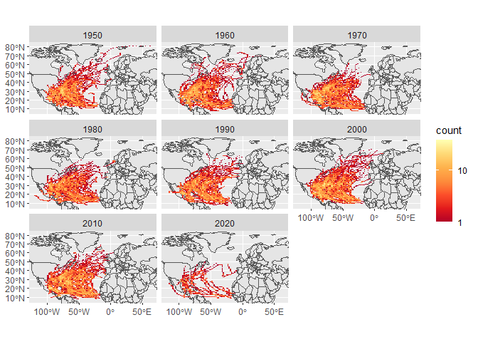

Case Study 09
================
Ting Chang
November 2, 2020

# Tracking Hurricanes!

### Load libraries and data

``` r
# Libraries and Data
library(sf)
library(tidyverse)
library(ggmap)
library(spData)

data(world)
data(us_states)


# Download and Unzip NOAA Data
dataurl = "https://www.ncei.noaa.gov/data/international-best-track-archive-for-climate-stewardship-ibtracs/v04r00/access/shapefile/IBTrACS.NA.list.v04r00.points.zip"

tdir = tempdir()
download.file(dataurl,destfile=file.path(tdir,"temp.zip"))
unzip(file.path(tdir,"temp.zip"),exdir = tdir)

# list.files(tdir)
```

### Read storm data

``` r
# Read Storm Data
storm_data <- read_sf(list.files(tdir,pattern=".shp",full.names = T))
```

### Prepare storm sf object

``` r
# Clean Up Storm Data
storm_1950 <- storm_data %>%
  filter(SEASON >= 1950) %>%
  mutate_if(is.numeric, function(x) ifelse(x==-999.0,NA,x)) %>%
  mutate(decade=(floor(year/10)*10))

# Find Boundaries of Storm Data
region <- st_bbox(storm_1950)
```

### Plot the storms

``` r
# Plot Out Storms by Each Decade
storm_plot <- ggplot(data=world) +
  geom_sf() +
  stat_bin2d(data=storm_1950, aes(y=st_coordinates(storm_1950)[,2], x=st_coordinates(storm_1950)[,1]),bins=100) +
  scale_fill_distiller(palette="YlOrRd", trans="log", direction=-1, breaks = c(1,10,100,1000)) +
  facet_wrap(~decade) +
  coord_sf(ylim=region[c(2,4)], xlim=region[c(1,3)]) +
  theme(axis.title.x=element_blank(),
        axis.title.y=element_blank())

storm_plot
```

<!-- -->

### Top 5 States that have experienced the most storms

``` r
# Library for Generating Table
library(kableExtra)

# Convert Coordinate System
us_transform <- us_states %>%
  st_transform(st_crs(storm_1950)) %>%
  rename(state=NAME)

# Double check the coordinate systems
# st_crs(us_states)
# st_crs(us_transform)
# st_crs(storm_1950)

# Join US sf Object with Storm sf Object
storm_states <- st_join(storm_1950, us_transform, join = st_intersects, left = F)

# Generate the Table
storm_states %>%
  group_by(state) %>%
  summarize(storms = length(unique(NAME))) %>%
  arrange(desc(storms)) %>%
  slice(1:5) %>%
  st_set_geometry(NULL) %>%
  knitr::kable(format="simple") #Learned from Betsy from week 8's group discussion
```

| state          | storms |
|:---------------|-------:|
| Florida        |     82 |
| North Carolina |     62 |
| Georgia        |     57 |
| Texas          |     53 |
| Louisiana      |     49 |
