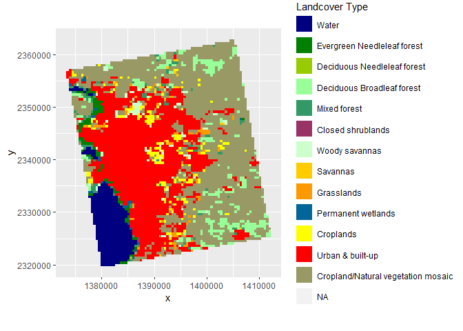
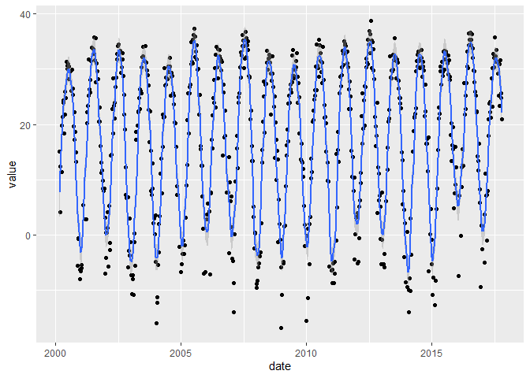
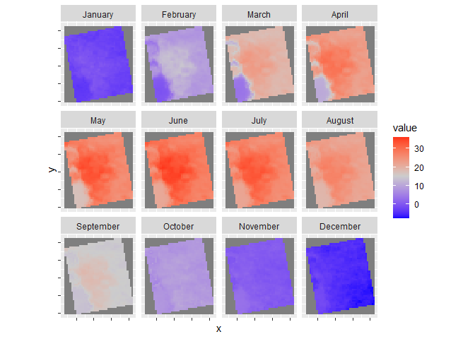
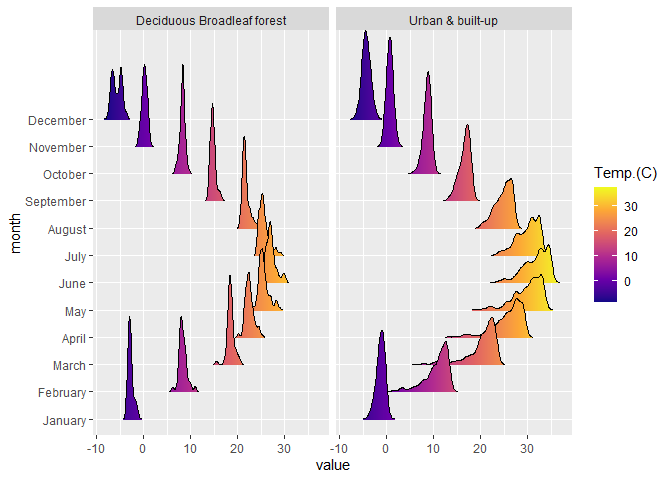

Case Study 10
================
Ting Chang
November 11, 2020

# Satellite Remote Sensing

## Load Related Libraries and Data in R

``` r
# Libraries
library(raster)
library(rasterVis)
library(rgdal)
library(ggmap)
library(tidyverse)
library(knitr)
library(ggplot2)

# Data
library(ncdf4)
```

## Land Use Land Cover

### Preparing LULC Data

``` r
# Create a folder to hold the downloaded data
dir.create("data",showWarnings = F)

lulc_url="https://github.com/adammwilson/DataScienceData/blob/master/inst/extdata/appeears/MCD12Q1.051_aid0001.nc?raw=true"
lst_url="https://github.com/adammwilson/DataScienceData/blob/master/inst/extdata/appeears/MOD11A2.006_aid0001.nc?raw=true"


# download them
download.file(lulc_url,destfile="data/MCD12Q1.051_aid0001.nc", mode="wb")
download.file(lst_url,destfile="data/MOD11A2.006_aid0001.nc", mode="wb")

# Load LULC data in R
lulc=stack("data/MCD12Q1.051_aid0001.nc",varname="Land_Cover_Type_1")
lst=stack("data/MOD11A2.006_aid0001.nc",varname="LST_Day_1km")
```

### LULC Data Processing

``` r
# # Explore Data
# plot(lulc)

lulc=lulc[[13]]
# plot(lulc)

# Assign land cover types
 Land_Cover_Type_1 = c(
    Water = 0, 
    `Evergreen Needleleaf forest` = 1, 
    `Evergreen Broadleaf forest` = 2,
    `Deciduous Needleleaf forest` = 3, 
    `Deciduous Broadleaf forest` = 4,
    `Mixed forest` = 5, 
    `Closed shrublands` = 6,
    `Open shrublands` = 7,
    `Woody savannas` = 8, 
    Savannas = 9,
    Grasslands = 10,
    `Permanent wetlands` = 11, 
    Croplands = 12,
    `Urban & built-up` = 13,
    `Cropland/Natural vegetation mosaic` = 14, 
    `Snow & ice` = 15,
    `Barren/Sparsely vegetated` = 16, 
    Unclassified = 254,
    NoDataFill = 255)

lcd=data.frame(
  ID=Land_Cover_Type_1,
  landcover=names(Land_Cover_Type_1),
  col=c("#000080","#008000","#00FF00", "#99CC00","#99FF99", "#339966", "#993366",
        "#FFCC99", "#CCFFCC", "#FFCC00", "#FF9900", "#006699", "#FFFF00", "#FF0000",
        "#999966", "#FFFFFF", "#808080", "#000000", "#000000"), stringsAsFactors = F)
# colors from https://lpdaac.usgs.gov/about/news_archive/modisterra_land_cover_types_yearly_l3_global_005deg_cmg_mod12c1

kable(head(lcd))
```

|                             |  ID | landcover                   | col      |
|:----------------------------|----:|:----------------------------|:---------|
| Water                       |   0 | Water                       | \#000080 |
| Evergreen Needleleaf forest |   1 | Evergreen Needleleaf forest | \#008000 |
| Evergreen Broadleaf forest  |   2 | Evergreen Broadleaf forest  | \#00FF00 |
| Deciduous Needleleaf forest |   3 | Deciduous Needleleaf forest | \#99CC00 |
| Deciduous Broadleaf forest  |   4 | Deciduous Broadleaf forest  | \#99FF99 |
| Mixed forest                |   5 | Mixed forest                | \#339966 |

### LULC Plot

``` r
# convert to raster (easy)
lulc=as.factor(lulc)

# update the RAT with a left join
levels(lulc)=left_join(levels(lulc)[[1]],lcd)

# plot it
lulc_plot <- gplot(lulc)+
  geom_raster(aes(fill=as.factor(value)))+
  scale_fill_manual(values=levels(lulc)[[1]]$col,
                    labels=levels(lulc)[[1]]$landcover,
                    name="Landcover Type")+
  coord_equal()+
  theme(legend.position = "right")+
  #figure get cropped when putting the legend at button
  guides(fill=guide_legend(ncol=1,byrow=TRUE))

lulc_plot
```

<!-- -->

## Land Surface Temperature

### LST Data Process

``` r
# Convert temperature
# plot(lst[[1:12]])

offs(lst)=-273.15
# plot(lst[[1:10]])

# Convert dates
# names(lst)[1:5]

tdates=names(lst)%>%
  sub(pattern="X",replacement="")%>%
  as.Date("%Y.%m.%d")

names(lst)=1:nlayers(lst)
lst=setZ(lst,tdates)
```

## Task 1

Extract LST values for a single point and plot them.

``` r
# Define spatial point
lw = SpatialPoints(data.frame(x= -78.791547,y=43.007211))

# Define and transform the projection
projection(lw) <- "+proj=longlat"
spTransform(lw, proj4string(lst))

# Extract values
lw_temp <- raster::extract(lst,lw,buffer=1000,fun=mean,na.rm=T)
lw_temp <- t(lw_temp)

# Extract dates
dates <- getZ(lst)

# Combine values and dates
lw_combine <- data.frame(
  date=dates,
  value=lw_temp)
```

``` r
# Plot the results
lw_plot <- ggplot(lw_combine, aes(x=date, y=value)) +
  geom_point()+
  geom_smooth(span=0.05, n=500)

lw_plot
```

<!-- -->

## Task 2

Summarize weekly data to monthly climatologies

``` r
# Convert dates to months
tmonth <- as.numeric(format(getZ(lst),"%m"))

# Summary mean value per month
lst_month <- stackApply(lst, tmonth, fun=mean)
names(lst_month)=month.name
```

``` r
# Plot the results
lst_monthly_plot <-gplot(lst_month) +
  geom_raster(aes(fill=value))+
  facet_wrap(~ variable)+
  #facet_wrap refers to "https://cran.r-project.org/web/packages/rasterVis/rasterVis.pdf"
  scale_fill_gradient2(low='blue', mid='grey80', high='red', midpoint=15)+
  #scale_*_gradient2 refers to "https://ggplot2.tidyverse.org/reference/scale_gradient.html"
  coord_equal()+
  theme(axis.text.x=element_blank(),
        axis.text.y=element_blank())

lst_monthly_plot
```

<!-- -->

``` r
# Calculate the monthly mean
monthly_mean <- cellStats(lst_month, mean)
kable(monthly_mean, format='simple', col.names='Mean')
```

|           |      Mean |
|-----------|----------:|
| January   | -2.127506 |
| February  |  8.710271 |
| March     | 18.172077 |
| April     | 23.173591 |
| May       | 26.990005 |
| June      | 28.840144 |
| July      | 27.358260 |
| August    | 22.927727 |
| September | 15.477510 |
| October   |  8.329881 |
| November  |  0.586179 |
| December  | -4.754134 |

## Task 3

Summarize Land Surface Temperature in Urban & built-up and Deciduous
Broadleaf forest areas.

``` r
# Resample the LULC data
lulc_resample <- resample(lulc, lst, method='ngb')

# Extract lst month values
lulc_temp = cbind.data.frame(
  values(lst_month),
  ID=values(lulc_resample[[1]])) %>%
  na.omit()

# Convert to tidy format
tidy_lulc_temp <- gather(lulc_temp, key='month', value='value',-ID)

# Convert the columns
tidy_lulc_temp <- tidy_lulc_temp %>%
  mutate(ID=as.numeric(ID),
         month=factor(month,levels=month.name,ordered=T))

# Join with lcd table
merge_lulc_temp <- left_join(tidy_lulc_temp, lcd)

# Filter our the urban and forest
urban_forest_temp <- merge_lulc_temp %>%
  filter(landcover%in%c("Urban & built-up","Deciduous Broadleaf forest"))
```

``` r
# Plot out the results
library(ggridges)
library(viridisLite)

urban_forest_plot <- ggplot(urban_forest_temp, aes(x=value, y=month, fill=stat(x)))+
  geom_density_ridges_gradient(scale=4, rel_min_height=0.001)+
  scale_fill_viridis_c(name="Temp.(C)", option = "C")+
  facet_wrap(~ landcover)

urban_forest_plot
```

<!-- -->
