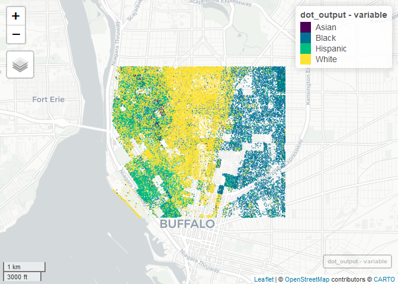

Case Study 11
================
Ting Chang
November 17, 2020

# Racial Distribution in Buffalo, NY

### Set Up

``` r
library(tidyverse)
library(spData)
library(sf)
library(mapview) # new package that makes easy leaflet maps
library(foreach)
library(doParallel)
library(tidycensus)

registerDoParallel(4)
getDoParWorkers() # check registered cores
```

    ## [1] 4

### Download Census Data

``` r
racevars <- c(White = "P005003", 
              Black = "P005004", 
              Asian = "P005006", 
              Hispanic = "P004003")

options(tigris_use_cache = TRUE)
erie <- get_decennial(geography = "block", variables = racevars, 
                  state = "NY", county = "Erie County", geometry = TRUE,
                  summary_var = "P001001", cache_table=T)
```

### Crop the Downloaded Data

``` r
boundary <- c(xmin=-78.9,xmax=-78.85,ymin=42.888,ymax=42.92)
erie_crop <- st_crop(erie, boundary)
```

### Generate Dots to Represent Racial Distribution

``` r
erie_crop$variable <- as.factor(erie_crop$variable)

dot_output <- foreach(i=1:4, .combine='rbind', .packages = c("tidyverse","sf")) %dopar% {
  
  race <- levels(erie_crop$variable)[i]
  
  erie_crop %>%
    filter(variable == race) %>%
    st_sample(size=.$value) %>%
    st_as_sf() %>%
    mutate(variable=race)
}

# %dopar% keep running in several errors
# solving by specifying package name
# refers to:
# "https://stackoverflow.com/questions/34022083/parallel-computation-loading-packages-in-each-thread-only-once/34030445#34030445"
# "https://stackoverflow.com/questions/17157211/error-when-using-dopar-instead-of-do-in-r-package-doparallel"
```

### Plot the Dot Map

``` r
mapview(dot_output, zcol="variable", cex=1, lwd=0)
```

<!-- -->
