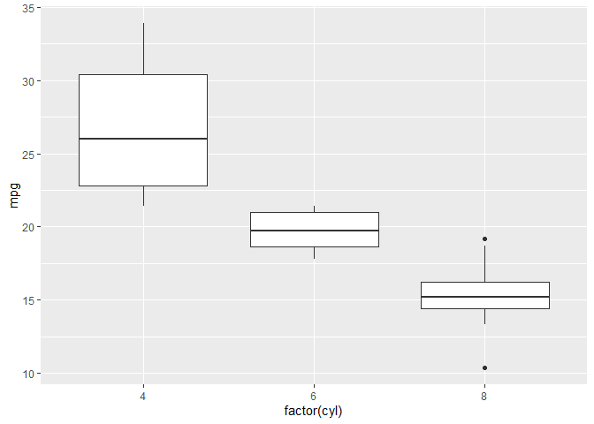
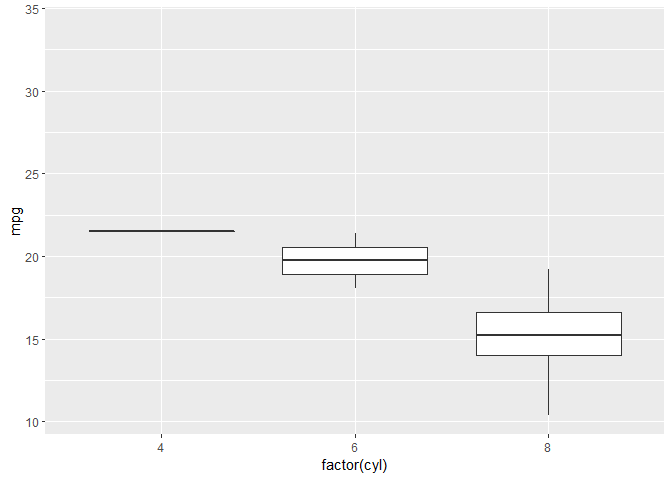
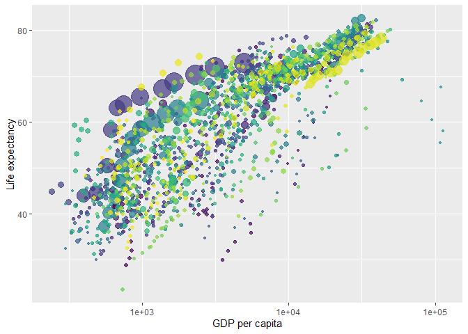
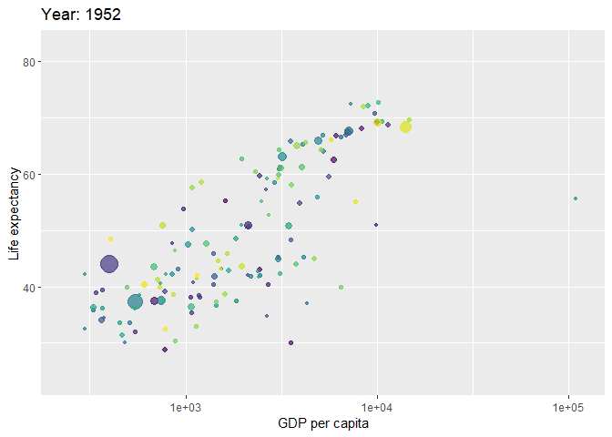
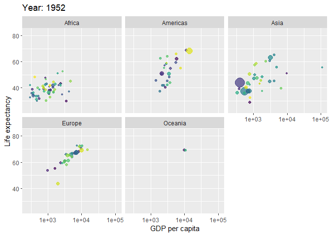
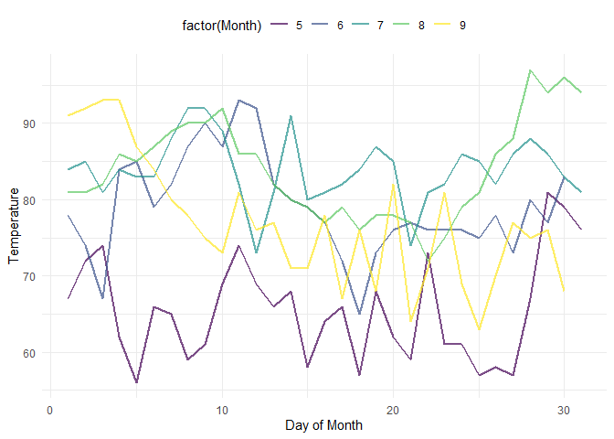
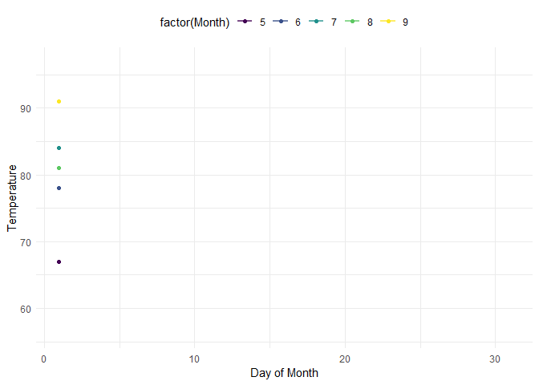

Resource Presentation
================
Ting Chang
November 19, 2020

# gganimate

The Example code was from:  
- <https://gganimate.com/index.html> (official documentation)  
-
<https://www.datanovia.com/en/blog/gganimate-how-to-create-plots-with-beautiful-animation-in-r/>

## Libraries

``` r
library(ggplot2)
library(gganimate)
# Data
library(gapminder)
```

## Basics

``` r
static <- ggplot(mtcars, aes(factor(cyl), mpg)) +
  geom_boxplot()

static  
```

<!-- -->

``` r
anim <- static +
  transition_states(             #split data into multiple states based on the levels in a given column
    gear,                       
    transition_length = 1,       #the length of the transition
    state_length = 1             #the length of the pause at the states
  ) +
  enter_fade() +                 #fade in
  exit_shrink() +                #shrink out
  ease_aes('exponential-in-out') #define how a value change to another during tweening

anim
```

<!-- -->

## Application for transition through time

``` r
p <- ggplot(gapminder, aes(x=gdpPercap, y=lifeExp, size=pop, colour=country)) +
  geom_point(show.legend = FALSE, alpha = 0.7) +
  scale_color_viridis_d() +
  scale_size(range = c(1, 10)) +
  scale_x_log10() +
  labs(x = "GDP per capita", y = "Life expectancy")

p
```

<!-- -->

``` r
p + transition_time(year) +
  labs(title = "Year: {frame_time}")
  #use glue syntax to insert frame variables in plot labels and titles
  #different transitions provide different frame variables
```

<!-- -->

``` r
p + facet_wrap(~continent) +
  transition_time(year) +
  labs(title = "Year: {frame_time}")
```

<!-- -->

## Reveal data based on given time dimension

``` r
p2 <- ggplot(airquality, aes(x=Day, y=Temp, group=Month, color = factor(Month))) +
  geom_line(size=1, alpha=0.7) +
  scale_color_viridis_d() +
  labs(x = "Day of Month", y = "Temperature") +
  theme_minimal() +
  theme(legend.position = "top")

p2
```

<!-- -->

``` r
p2 + geom_point(aes(group = seq_along(Day))) +
  transition_reveal(Day)
```

<!-- -->

More information could be found here:  
- The official documentation: <https://gganimate.com/index.html>  
- Thomas Pedersen’s website:
<https://www.data-imaginist.com/2019/gganimate-has-transitioned-to-a-state-of-release/>  
- Thomas Pedersen’s GitHub: <https://github.com/thomasp85/gganimate>
