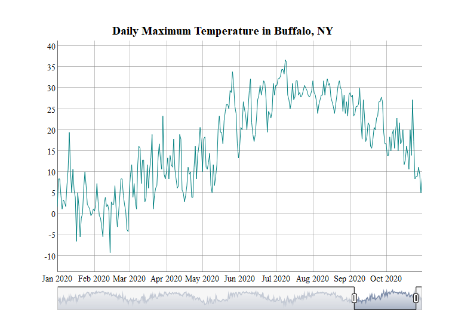
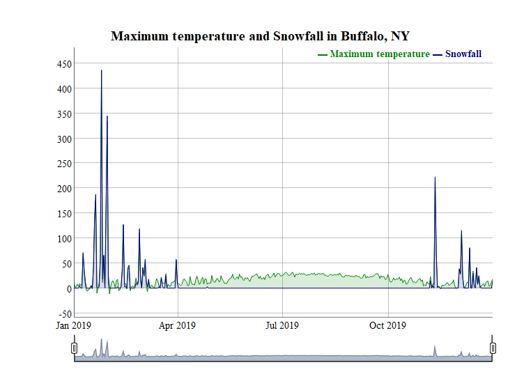

Case Study 12
================
Ting Chang
November 30, 2020

# Dynamic HTML graph

### Load packages

``` r
library(dplyr)
library(ggplot2)
library(ggmap)
library(htmlwidgets)
library(widgetframe)
```

### Download daily weather data

``` r
library(tidyverse)
library(rnoaa)
library(xts)
library(dygraphs)

# meteo_clear_cache()
# Learn from here: https://github.com/ropensci/rnoaa/issues/272 (the code of the original post)
 
d=meteo_tidy_ghcnd(stationid = "USW00014733",
                   date_min = "2016-01-01", 
                   var = c("TMAX", "PRCP", "SNOW", "SNWD"),
                   keep_flags=T) %>% 
   mutate(date=as.Date(date),
          tmax=as.numeric(tmax)/10) #Divide the tmax data by 10 to convert to degrees.
```

### Plot the daily maximum temperature

``` r
tmax_xts <- xts(d$tmax, order.by = d$date)

dygraph(tmax_xts, main="Daily Maximum Temperature in Buffalo, NY") %>%
    dyRangeSelector(dateWindow = c("2020-01-01", "2020-10-31"))
```

<!-- -->

### Explore other variables

``` r
d_2019 <- filter(d, date >= "2019-01-01" & date <= "2019-12-31")

tmax_19_xts <- xts(d_2019$tmax, order.by = d_2019$date)
# prcp_19_xts <- xts(d_2019$prcp, order.by = d_2019$date)
snow_19_xts <- xts(d_2019$snow, order.by = d_2019$date)
# snwd_19_xts <- xts(d_2019$snwd, order.by = d_2019$date)

weather_19 <- cbind(tmax_19_xts, snow_19_xts)

dygraph(weather_19, main = "Maximum temperature and Snowfall in Buffalo, NY") %>%
  dySeries("tmax_19_xts", label = "Maximum temperature") %>%
  dySeries("snow_19_xts", label = "Snowfall") %>%
  dyOptions(stackedGraph = TRUE) %>%
  dyRangeSelector()
```

<!-- -->
